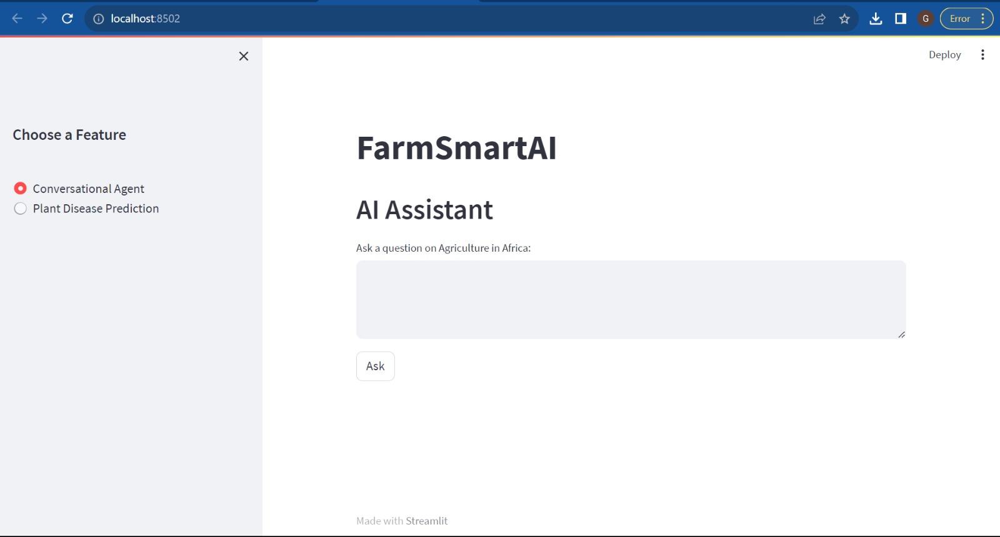
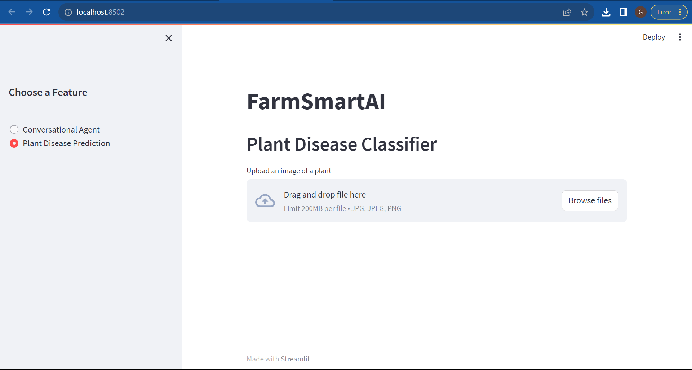

# AGRI-AI
An agricultural information source that incorporates AI tools aiming to improve productivity and promote sustainable agricultural practices. 

# Technologies Used
Generative AI - Using OpenAI's davinci model to generate agricultural suggestions based on a given prompt.
Computer Vision - Using an AI model built  to identify plant diseases and pests. Using Tensorflow, Pandas, Pillow, NumPy, and PyTorch.
Natural Language Processing - Using NLTK to analyze text and extract keywords to be used as prompts for the generative AI model.
Frameworks - To visualize the model's output, we used Streamlit to build a web application.

# How to Run
The project is currently hosted on Streamlit Cloud at https://share.streamlit.io/agri-ai/main/app.py

To run the project locally, clone the repository and run the following commands in the terminal:

Streamlit run app.py

As of now, we offer two key services: the conversational chatbot and the plant disease classification. Improvements are to be made to improve the models' accuracy. The plant disease model will also be improved to provide remedies for the detected disease and suggest possible causes as well as preventive measures. 

# Contributors
- [Shalyn Muita ]()
- [Youness Ouialane]()

# Future Directions
- Incorporate more AI models to improve the accuracy of the suggestions. My team is working on improving the accuracy of our already built models as well coming up with more models to be used as tools for optimum production all while encouraging sustainable farming practices.
- Work on the UI/UX of the website.
- Make it a cross-platform mobile application.
- Provide information from industry experts on best practices and ways to promote sustainable farming practices.
- Train the model on more data to improve the accuracy of the suggestions, advance it to include localization, and make it more robust.
